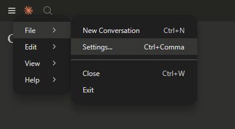
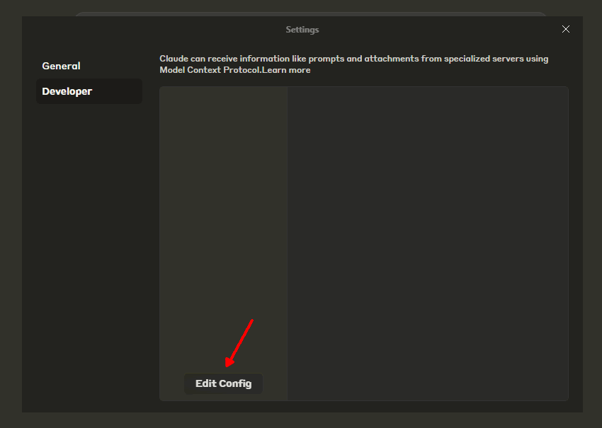
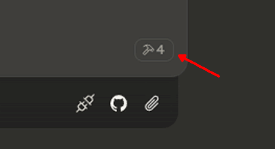
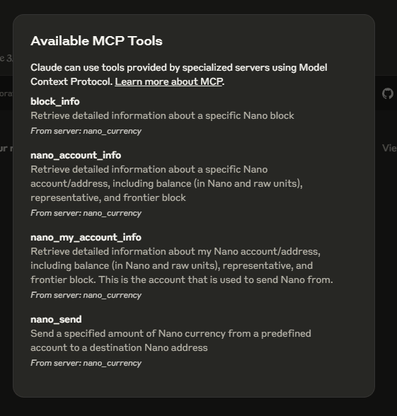

# Nano Currency MCP Server
[](https://smithery.ai/server/@kilkelly/nano-currency-mcp-server)

This Model Context Protocol (MCP) server gives MCP-compatible clients (which include some AI agents) the ability to send Nano currency and retrieve account & block information via the Nano node RPC.

<a href="https://glama.ai/mcp/servers/@kilkelly/nano-currency-mcp-server">
  
</a>

AI agents are increasingly adopting the MCP standard so this server can give them the ability to send Nano at their owner's request or possibility autonomously in some setups 🤖

## ❔ What is MCP?

The Model Context Protocol (MCP) is an open framework that defines a standardized approach for applications to deliver context to Large Language Models (LLMs).

## ❔ What is Nano Currency?

Nano is a digital currency designed to enable fast, scalable, and feeless transactions. It aims to address common issues in traditional cryptocurrencies, such as high fees and slow processing times, making it an efficient option for everyday peer-to-peer payments. Learn more at [nano.org](https://nano.org)

## 🚨 Before Proceeding 🚨

Caution: LLMs can hallucinate and not always perform as you want so test this server with small amounts of Nano.

## 🛠️ Tools Provided by the MCP Server

🔧 `nano_send` - Sends a specified amount of Nano currency

🔧 `nano_account_info` - Retrieves detailed information about a specific Nano account/address

🔧 `nano_my_account_info` - Retrieves detailed information about your predefined Nano account/address

🔧 `block_info` - Retrieves detailed information about a specific Nano block

## Prerequisites

Make sure you have [Node.js](https://nodejs.org/) with NPM installed. 

## Setup

```
git clone https://github.com/kilkelly/nano-currency-mcp-server.git
cd nano-currency-mcp-server
npm install
```


You will need an MCP client to connect to the MCP server (see the Claude Desktop setup later as an example MCP client). Each client will have its own way to connect to MCP servers. For your chosen client you will have to find out how environment variables for a MCP server are set. When you know how you will need to set the following environment variables to use the Nano Currency MCP Server.

### Environment Variables

`NANO_RPC_URL` - URL which should be used to communicate with a Nano node RPC. This can be a local or remotely hosted endpoint.
This URL value is **required**.

`NANO_WORK_GENERATION_URL` - URL which should be used to communicate with an endpoint that supports the [work_generate](https://docs.nano.org/commands/rpc-protocol/#work_generate) RPC command for work generation. If not specified, defaults to `NANO_RPC_URL`. Used by tool 🔧 `nano_send`

`NANO_PRIVATE_KEY` - Nano private key which will be used to sign send transactions and to derive the Nano address from. Caution: 🚨*NOT THE WALLET SEED*🚨. Test with the private key of an account with a small Nano balance. Used by tools 🔧 `nano_send` and 🔧 `nano_my_account_info`

`NANO_MAX_SEND_AMOUNT` - Maximum amount (in nano/Ӿ units) which can be sent in a single transaction. For safety purposes the default maximum send amount is 0.01 nano (Ӿ0.01). You must set this variable explicitly to grant the power to send higher amounts. Used by tools: 🔧 `nano_send`

## Claude Desktop Setup

### 1. Install and run [Claude Desktop](https://claude.ai/download)


### 2. Open the Settings menu




### 3. Click the `Developer` tab and then `Edit Config` button to open the location of the Claude config file `claude_desktop_config.json`




### 4. Open up `claude_desktop_config.json` in your text editor of choice and enter the following but swapping out the values for your unique configuration:

```
{
  "mcpServers": {
    "nano_currency": {
      "command": "ENTER_FULL_FILE_PATH_TO_NODE_DOT_EXE_ON_YOUR_SYSTEM",
      "args": [
        "ENTER_FULL_FILE_PATH_TO_NANO_CURRENCY_JS_FILE_FROM_THIS_REPOSITORY"
      ],
      "env": {
        "NANO_RPC_URL": "ENTER_YOUR_NANO_RPC_URL",
        "NANO_WORK_GENERATION_URL": "ENTER_YOUR_NANO_WORK_GENERATION_URL",
        "NANO_PRIVATE_KEY": "ENTER_YOUR_NANO_PRIVATE_KEY",
        "NANO_MAX_SEND_AMOUNT": "ENTER_A_NEW_MAX_SEND_AMOUNT"
      }      
    }    
  }
}
```

Notes:

- ENTER_FULL_FILE_PATH_TO_NODE_DOT_EXE_ON_YOUR_SYSTEM should point to the `node.exe` executable in your Node.js installation e.g. `C:\\Program Files\\nodejs\\node.exe`
- ENTER_FULL_FILE_PATH_TO_NANO_CURRENCY_JS_FILE_FROM_THIS_REPOSITORY should point to the `nano-currency.js` file in this repository e.g. `C:\\projects\\nano-currency-mcp-server\\nano-currency.js`
- If you are using Windows you need to use double-backslashes in your file paths e.g. `C:\\Program Files\\nodejs\\node.exe`
- ENTER_YOUR_NANO_RPC_URL and ENTER_YOUR_NANO_WORK_GENERATION_URL may often be the same value, in that case just omit the NANO_WORK_GENERATION_URL line entirely. An example ENTER_YOUR_NANO_RPC_URL may look something like `http://localhost:7076`
- ENTER_YOUR_NANO_PRIVATE_KEY - This is 🚨*NOT A WALLET SEED*🚨 but rather the **private key** for a Nano address you control. This key is used when signing Nano transactions and to derive your Nano address from. Please test with a private key for an address containing a small amount of Nano.
- ENTER_A_NEW_MAX_SEND_AMOUNT is optional but you may use it if you want to override the default send maximum which is 0.01 nano (Ӿ0.01). Enter a numeric value only (without "nano" or "Ӿ"). It is recommended to not set this or set it lower than the default when testing, as it will prevent sending higher amounts of Nano than expected due to possible LLM hallucinations.


### 5. Save your changes to `claude_desktop_config.json` and restart Claude Desktop

### 6. If you have configured everything correctly you will see the following icon when you start up Claude Desktop



### Click on the icon to get a description of the tools installed



### 7. Try out the tools by prompting Claude Desktop with nano-related prompts

https://github.com/user-attachments/assets/c877cc5a-0847-416c-b169-a988cac796f9

## 🚨 Disclaimer 🚨
As always when working with real world value, in this case Nano, **be careful** when using this software. The authors and contributors shall not be held liable for any use of this software's functionality, intentional or unintentional, that leads to an undesired lose of funds.

## License
MIT